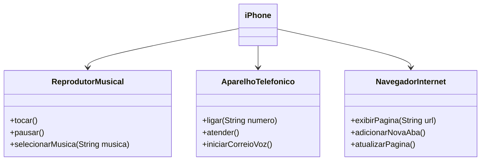

# dio-POO-desafio
### Modelagem e Diagramação de um Componente iPhone
Neste desafio, você será responsável por modelar e diagramar a representação UML do componente iPhone, abrangendo suas funcionalidades como Reprodutor Musical, Aparelho Telefônico e Navegador na Internet.
### Contexto
Com base no vídeo de lançamento do iPhone de 2007 (link abaixo), você deve elaborar a diagramação das classes e interfaces utilizando uma ferramenta UML de sua preferência. Em seguida, implemente as classes e interfaces no formato de arquivos `.java`. 

## Ferramentas Utilizadas 🛠️
- IntelliJ IDE
- Visual Studio Code
- Mermaid

## Diagrama UML

